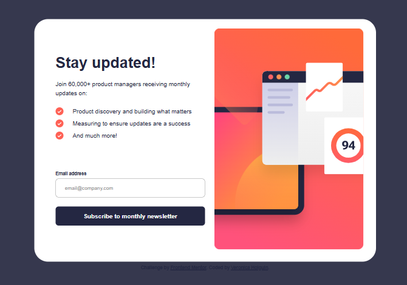
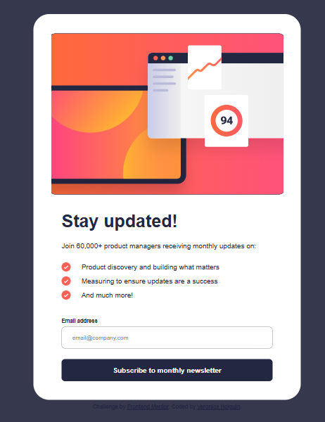
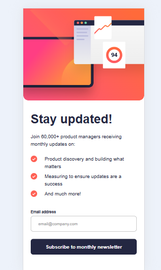

# Frontend Mentor - Newsletter sign-up form with success message solution

This is a solution to the [Newsletter sign-up form with success message challenge on Frontend Mentor](https://www.frontendmentor.io/challenges/newsletter-signup-form-with-success-message-3FC1AZbNrv).  
Frontend Mentor challenges help you improve your coding skills by building realistic projects.  

## Table of contents

  - [Overview](#overview)
  - [The challenge](#the-challenge)
  - [Screenshot](#screenshot)
  - [Links](#links)
  - [My process](#my-process)
  - [Built with](#built-with)
  - [What I learned](#what-i-learned)
  - [Continued development](#continued-development)
  - [Useful resources](#useful-resources)
  - [Author](#author)

## Overview

### The challenge

Users should be able to:

- Add their email and submit the form
- See a success message with their email after successfully submitting the form
- See form validation messages if:
  - The field is left empty
  - The email address is not formatted correctly
- View the optimal layout for the interface depending on their device's screen size
- See hover, focus and active states for all interactive elements

### Screenshot

#### Desktop version

#### Tablet version

#### Mobile version

(Add your own screenshot here showing both mobile and desktop versions)

### Links

- Solution URL: [GitHub Repo](https://github.com/your-username/newsletter-signup)  
- Live Site URL: [Live Demo](https://your-username.github.io/newsletter-signup/)

---

## My process

### Built with

- Semantic **HTML5** markup  
- **CSS custom properties**  
- **Flexbox**   
- **Mobile-first workflow**  
- **Vanilla JavaScript** (form validation + success page)  

### What I learned

What I learned

- Flex vs Grid in desktop layout
At first, I tried using Grid to arrange the image and the text, but it caused alignment issues: the text block wouldn’t stay at the top as required by the design.  
Switching to **Flex** with `flex-direction: row` and `align-items: stretch` solved the problem and gave me more natural control in this case.

- Controlling heights with `min-height` and `height`
`min-height: 100vh` worked well on mobile to cover the full screen.  
For tablet and desktop, the design required smaller cards, so I overrode it with `min-height: auto` inside media queries and set a fixed `height`. This prevented unnecessary stretching.

- Responsive spacing with `clamp()`
I learned to use `clamp(min, preferred, max)` for paddings. This lets spacing grow and shrink smoothly with the viewport, avoiding jumps between breakpoints.

.page-wrapp {
  padding-block: clamp(16px, 5vw, 120px);
  padding-inline: clamp(16px, 7vw, 160px);
}

- Responsive spacing with object-fit

The image needed to cover the available area without distortion. The key was:

.card-img      { width: 100%; height: 100%; }
.card-img img  { width: 100%; height: 100%; object-fit: cover; }

- Checklist with aligned icons

Multi-line text didn’t align nicely with icons. I fixed it with:

.checklist li {
  display: flex;
  align-items: flex-start;
  gap: 8px;
}

- JavaScript

I implemented the core interactivity and identified areas to keep improving in how I structure and organize the JS logic for larger projects.

#### Continued development

Stronger form validation patterns and accessibility 

More fluid responsive layouts mixing Flex/Grid

Small UI polish: transitions for error states and page changes

#### Useful resources

- [CSS-Tricks](https://css-tricks.com/)
- [Frontend Mentor Community](https://www.frontendmentor.io/community)

#### Author

- Frontend Mentor – [@veroholgc](https://www.frontendmentor.io/profile/veroholgc)  
- GitHub – [veroholgc](https://github.com/veroholgc)

